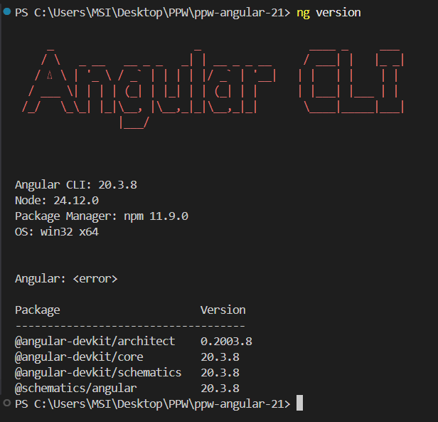
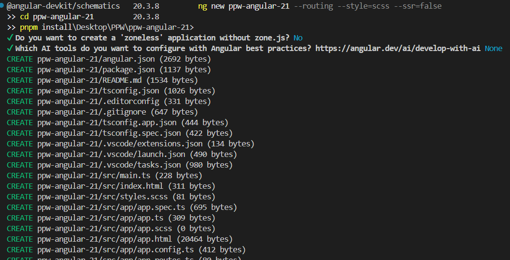
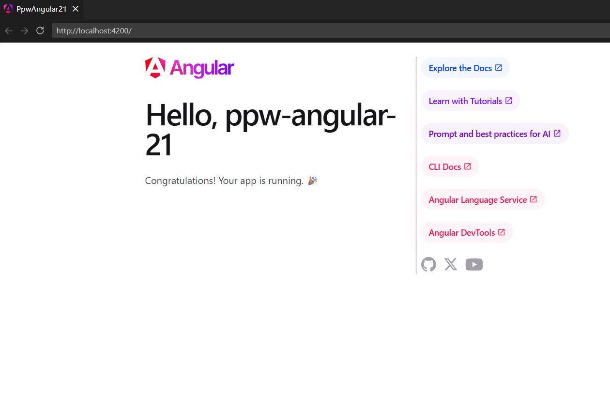
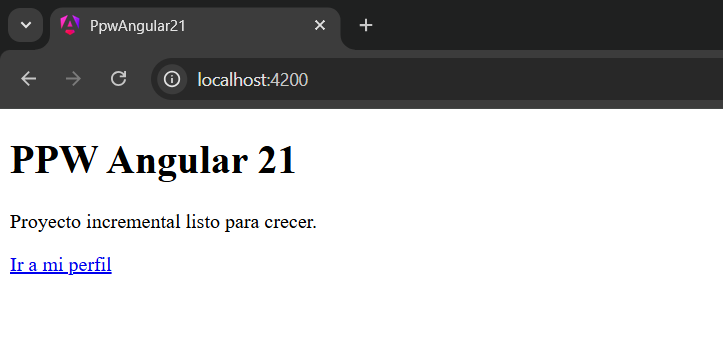

# Programación y Plataformas Web

# Angular para Desarrollo Web

<div align="center">
  
</div>

## Módulo 1: Instalación y Configuración del Entorno - Práctica

### Autora

**Cinthya Ramón**  
cramonm1@est.ups.edu.ec  

GitHub: [CinthyLu](https://github.com/CinthyLu)

---

## 1. Introducción

Angular es un framework desarrollado por Google para la construcción de aplicaciones web modernas basadas en componentes. En esta práctica se configuró el entorno inicial del proyecto `ppw-angular-21`, preparando una arquitectura base que permitirá continuar el desarrollo incremental en los siguientes módulos.

El objetivo principal fue instalar Angular CLI, crear el proyecto con routing habilitado, organizar la estructura inicial mediante `features/` y configurar las rutas principales de la aplicación.

---

## 2. Objetivo

Crear el proyecto incremental `ppw-angular-21` utilizando Angular 21, habilitando routing y dejando una estructura limpia, escalable y preparada para futuras prácticas.

---

## 3. Estructura del Proyecto

```text
ppw-angular-21/
├── src/
│   ├── app/
│   │   ├── app.config.ts
│   │   ├── app.routes.ts
│   │   ├── app.ts
│   │   ├── app.html
│   │   ├── app.scss
│   │   └── features/
│   │       └── home/
│   │           └── pages/
│   │               └── home-page.ts
│   ├── styles.scss
│   └── main.ts
├── evidencias/
│   └── assets/
│       ├── 01-ng-version.png
│       ├── 01-ng-new.png
│       ├── 01-app-inicio.png
│       └── 01-home-page.png
├── package.json
└── README.md
```

---

## 4. Tecnologías Utilizadas

- Angular 21
- TypeScript
- SCSS
- Node.js
- pnpm
- Angular Router

---

## 5. Desarrollo de la Práctica

### 5.1 Verificación del entorno

Se comprobó la instalación de Node.js, pnpm y Angular CLI mediante:

```bash
node --version
pnpm --version
ng version
```

Posteriormente se ejecutó el proyecto para validar que Angular funcionara correctamente:

```bash
pnpm start
```

---

### 5.2 Creación del proyecto Angular

El proyecto fue creado utilizando Angular CLI con routing habilitado y SCSS como sistema de estilos.

```bash
ng new ppw-angular-21 --routing --style=scss --ssr=false
```

Luego se ingresó al proyecto y se instalaron las dependencias:

```bash
cd ppw-angular-21
pnpm install
```

---

### 5.3 Creación de la estructura `features/`

Se organizó el proyecto utilizando una estructura basada en funcionalidades para evitar crecimiento desordenado del código.

```text
features/
└── home/
    └── pages/
        └── home-page.ts
```

---

### 5.4 Configuración de `HomePage`

Se creó el componente inicial `HomePage` para mostrar la vista principal de la aplicación.

```ts
import { Component } from '@angular/core';

@Component({
  selector: 'app-home-page',
  template: `
    <section>
      <h1>PPW Angular 21</h1>
      <p>Proyecto incremental listo para crecer.</p>
    </section>
  `,
})
export class HomePage {}
```

**Descripción:**  
Este componente representa la página inicial del proyecto y será la base para los siguientes módulos.

---

### 5.5 Configuración de rutas

Se configuró el archivo `app.routes.ts` para definir la ruta principal y la redirección wildcard.

```ts
import { Routes } from '@angular/router';
import { HomePage } from './features/home/pages/home-page';

export const routes: Routes = [
  {
    path: '',
    component: HomePage,
  },
  {
    path: '**',
    redirectTo: '',
  },
];
```

**Descripción:**  
La ruta raíz `/` carga `HomePage` y cualquier ruta inexistente redirige automáticamente al inicio.

---

### 5.6 Simplificación del componente raíz

Se redujo el componente `App` a un contenedor mínimo utilizando `RouterOutlet`.

```ts
import { Component } from '@angular/core';
import { RouterOutlet } from '@angular/router';

@Component({
  selector: 'app-root',
  imports: [RouterOutlet],
  templateUrl: './app.html',
  styleUrl: './app.scss',
})
export class App {
  title = 'ppw-angular-21';
}
```

Archivo `app.html`:

```html
<main class="app-shell">
  <router-outlet />
</main>
```

**Descripción:**  
`RouterOutlet` permite renderizar dinámicamente el componente asociado a la ruta activa.

---

### 5.7 Configuración de estilos globales

Se definieron estilos base globales para la aplicación.

```scss
:root {
  font-family: Inter, system-ui, sans-serif;
  color: #172033;
  background: #f5f7fb;
}

body {
  margin: 0;
}

.app-shell {
  min-height: 100vh;
}
```

**Descripción:**  
Estos estilos establecen una base visual limpia y consistente para futuras prácticas.

---

### 5.8 Configuración global de Angular

Se verificó la configuración principal del proyecto en `app.config.ts`.

```ts
import { ApplicationConfig, provideZoneChangeDetection } from '@angular/core';
import { provideRouter } from '@angular/router';
import { routes } from './app.routes';

export const appConfig: ApplicationConfig = {
  providers: [
    provideZoneChangeDetection({ eventCoalescing: true }),
    provideRouter(routes),
  ],
};
```

**Descripción:**  
La configuración registra el sistema de rutas y optimiza la detección de cambios mediante `provideZoneChangeDetection`.

---

## 6. Validaciones Realizadas

- Node.js versión 18 o superior instalado
- pnpm funcionando correctamente
- Angular CLI versión 21 instalada
- Proyecto generado correctamente
- Routing habilitado
- Estructura `features/` creada
- `HomePage` renderizada correctamente
- Ruta wildcard funcionando
- Aplicación ejecutándose sin errores
- Proyecto sin `AppModule`

---

## 7. Evidencias

### 1. Verificación de Angular CLI




**Descripción:**  
Salida del comando `ng version` mostrando Angular CLI 21 correctamente instalado.

---

### 2. Creación del proyecto


**Descripción:**  
Proceso de creación del proyecto `ppw-angular-21` utilizando Angular CLI.

---

### 3. Página inicial de Angular



**Descripción:**  
Pantalla inicial generada automáticamente por Angular antes de modificar el proyecto.

---

### 4. HomePage funcionando



**Descripción:**  
Vista final de `HomePage` ejecutándose correctamente en `http://localhost:4200`.

---

## 8. Conclusiones

- Se configuró correctamente el entorno de desarrollo para Angular 21.
- La estructura basada en `features/` permite mantener un proyecto más ordenado y escalable.
- El sistema de rutas quedó preparado para futuras expansiones.
- El proyecto quedó listo para continuar con los siguientes módulos sin necesidad de rehacer configuraciones base.

---

## 9. Repositorio

GitHub: [CinthyLu](https://github.com/CinthyLu)

---